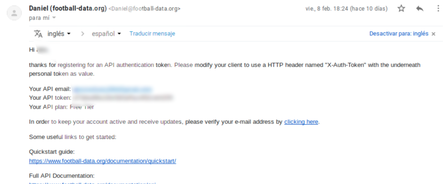

% Proyecto de página Wordpress con utilización de una API de fútbol.
% Miriam Tirado y Mouad Taiebi
% Febrero 2019

# Página Wordpress con utilización de una API de fútbol

## Acerca de 

Hemos querido crear una página cuya finalidad sea la de informar a todos los amantes del fútbol español y extranjero de los resultados y noticias relacionadas con este mundo.

## WordPress y API

**WordPress** es un sistema de gestión de contenidos o CMS (Content Management System) enfocado a la creación de cualquier tipo de página web.

La **interfaz de programación de aplicaciones**, (**API**), es un conjunto de subrutinas, funciones y procedimientos en la programación orientada a objetos que ofrece cierta biblioteca para ser utilizado por otro software como una capa de abstracción

## **Requisitos**
- Descarga de [Wordpress](https://es.wordpress.org/download/)
- Alojar Wordpress en un sitio (local en nuestro caso)
	- [Instalar Wordpress](https://miposicionamientoweb.es/como-instalar-wordpress-local/#a-instalar-wordpress-desde-cero)
- Tener acceso a una API
	- Nos registramos en la página [FootballData](https://www.football-data.org/pricing) y obtenemos el token necesario para que funcione nuestra página.
- Archivos de la API
	- Nos descargamos el zip que encontramos en el siguiente [enlace GitHub](https://github.com/dfrt82/phplib-football-data)
- XAMPP for Linux 
	
## **Requisitos** (II)

- Creación de un proyecto (para ir tanteando el terreno, hacer pruebas y consultas)
- Utilización del token recibido en el archivo **config.ini** 

# Instalación

## Instalación y Configuración de Wordpress

Una vez descargada la ultima versión del enlace anterior hay que descomprimirlo:

## Instalación y Configuración de Wordpress (II)

- sudo mv wordpress-5.0.3-es_ES.zip /opt/lampp/htdocs
- sudo unzip wordpress-5.0.3-es_ES.zip
Ésto genera una carpeta dentro de /opt/lampp/htdocs llamada wordpress

Una vez hecho esto entramos al siguiente enlace -> http://localhost/wordpress/wp-admin/setup-config.php para realizar la configuracion inicial de nuestra página de Wordpress.

## Instalación y Configuración de Wordpress (III)

## Instalación y Configuración de Wordpress (IV)

## Instalación y Configuración de Wordpress (V)

## Configuración de la API

Entramos en la siguiente [página](https://www.football-data.org)

## Configuración de la API (II)

Una vez nos encontramos registrados en dicha página recibiremos un correo a la cuenta introducida, en el que se nos asigna el token.

## Configuración de la API (III)

A continuacón entramos en Aptana para ver y probar los .php que nos hemos descargado con el token.

Como se puede ver en la foto, dentro del archivo **config.ini** introducimos nuestro token para poder comenzar.

## Configuración de la API (IV)

## Archivo **index.php**

Dentro de este archivo hay una variable llamada **$api** con un parámetro llamado **findMatchesByCompetitionAndMatchDay**; en este parámetro podemos encontrar dos códigos ID separados por comas. 

Nosotros hemos separado dichos códigos ID el primero sigue metido dentro de esa variable y parámetro anteriores; pero, el segundo código lo hemos sacado de ese parametro y metido en una variable para poder utilizarlo con una lista desplegable en nuestra página de WordPress.

## Archivo **index.php** (II)

Para encontrar que numero ID debiamos de poner en esos códigos hemos tenido que buscar informacion en la [página siguiente](https://www.football-data.org/documentation/quickstart).

El primer código equivale a la liga que quieras elegir, en nuestro caso **La Liga Santander**; en el segundo prámetro encontramos que era para la elección de la jornada en la que querias visualizar los resultados. por este motivo es por el que hemos separado este código ID del otro (para que nuestros usuarios puedan ver los resultados de la jornada que deseen).

## Modificación de archivos .php e .ini

Teníamos tres acrhivos, dos **.php** y uno **.ini**

Para que fuera más fácil la introducción de los archivos en la página hemos eliminado el archivo .ini de la siguiente forma:

## Modificación de archivos .php e .ini (II)

- En un principio lo teniamos asi:

	 

## Modificación de archivos .php e .ini (III)

- Lo cambiamos a la siguiente manera:

	

## Introducción de la API a nuestra página de WordPress

Necesitabamos encontrar un plugin que hiciera que nuestro **código PHP** fuera leído por WordPress.

### **XYZ PHP CODE**

Entramos en **plugins** y buscamos XYZ PHP CODE, lo descargamos, instalamos y activamos.

### **XYZ PHP CODE** (II)

Una vez lo tenemeos activado nos vamos a add New PHP Code Snippet e insertamos el códido php de **index.php**. 

### **XYZ PHP CODE** (III)

A continuación insertamos también el código php de **football-data.php**. 

### **XYZ PHP CODE** (IV)

Ya tenemos nuestros .php insertados para ver como funciona en WordPress.

Vamos a **Entradas** para añadir una nueva entrada y nos damos cuenta de que no sale la opción de añadir los archivos creados .php.

Investigamos por Internet y vemos que puede ser que nuestra version de WordPress no sea compatible con la del plugin XYZ PHP CODE.

### WOODY SNIPPETS

Buscando en Internet encontramos [**WOODY SNIPPETS**](https://es.wordpress.org/plugins/insert-php/) y nos disponemos a probarlo, para ver si con este si podemos realizar todo el proceso para introducir los .php en nuestra página.

### WOODY SNIPPETS (II)

Dentro de plugin lo descargamos, instalamos y activamos.

### WOODY SNIPPETS (III)

### WOODY SNIPPETS (IV)

Nos disponemos a introducir los códigos, dentro de Woody, en **PHP Snippet y Create Item**.

### WOODY SNIPPETS (V)

Insertamos primero index.php 

### WOODY SNIPPETS (IV)

Una vex insertado nuestro index.php insertamos también footballData.php.

Nos damos cuenta de que esta manera para insertar código php en WordPress tampoco nos sirve.

### Problema para insertar código PHP en **WordPress Versión 5.0.3**

El problema para ambos insertadores de código es que a partir de la versión 5 de WordPress el editor que tenemos por defecto es **Gutenberg**.

### Problema para insertar código PHP en **WordPress Versión 5.0.3** (II)

Para la utilización de los plugin que hemos probado tenemos que utilizar un [Editor Clasico.](https://es.wordpress.org/plugins/classic-editor/)

### Problema para insertar código PHP en **WordPress Versión 5.0.3** (III)

Hay que ir a Plugin, instalarlo y activarlo.

### Problema para insertar código PHP en **WordPress Versión 5.0.3** (IV)

A continuación, en Ajustes de escritura habilitamos la utilización del Editor Clasico.

### 

### Problema para insertar código PHP en **WordPress Versión 5.0.3** (V)

Una vez hecho ésto ya podemos insertar código php tanto con XYZ PHP CODE, como con WOODY SNIPPETS. Hemos optado por acabar utilizando **WOODY SNIPPETS**.

# Instalación y Personalización

### Instalación

Descargamos [una plantilla gratuita](https://www.hostinger.es/tutoriales/mejores-plantillas-wordpress) para su posterior utilización.

### Instalación (II)

Dentro de WordPress nos vamos a **apariencia, temas, añadir uno nuevo, subir tema, seleccionar archivo**; cuando está seleccionado lo instalamos.

### Instalación (III)

### Personalización del tema 

### Personalización del tema (II)

- **Identidad del sitio**
  - Añadir logo, Título, Descripción e Icono
- **Color**
  - Color cabecera
- **Imagen fondo**
  - Fondo página
- **Menú**
  - Menú superior
    - Inicio, Contacto y Acerca de...

### Personalización del tema (III)

- **Widgets**
  - Barra lateral
      - Últimas entradas, Audio (5 primeros clubs clasificados en La Liga), Comentarios recientes, Galería (mejores goles)
  - Pie Página 1 - anchura 1/4
    > [RSS (EL MUNDO DEPORTIVO)](https://www.mundodeportivo.com/mvc/feed/rss/home)
  - Píe pagina 2 - anchura 1/4
    > [RSS (MARCA)](https://e00-marca.uecdn.es/rss/futbol/primera-division.xml)
  - Píe pagina 3 - anchura 1/4
    > [RSS (SPORT)](https://www.sport.es/es/rss/laliga/rss.xml)
  - Píe pagina 4 - anchura 1/4
    > [RSS (DIARIO GOL)](https://www.diariogol.com/uploads/feeds/feed_dg_es.xml)

# Tablas de resultados deportivos

## Creación Primeras Tablas

Su creación ha sido la más complicada.

En esta [página](https://shellcreeper.com/wp-ajax-for-beginners/) descagamos el **.zip** "john-cena", es un plugin que utilizaremos a continuación.

## Creación Primeras Tablas (II)

En el .zip encontramos 

## Creación Primeras Tablas (III)

Dentro de WordPress, plugin, añadir nuevo, subir plugin,lo seleccionamos, subimos, instalamos y activamos. 

## Creación Primeras Tablas (IV)

Añadimos los **.php** a la dirección **/opt/lampp/htdocs/wordpress/wp-content/plugins/wp-ajax-noob-p1-john-cena**

### Modificaciones

- Modificación **wp-ajax-noob.php**
  
   

### Modificaciones (II)

- Modificación **showResult**
 
  

### Modificaciones (III)

Existen dos maneras de hacerlo

### Modificaciones (IV)

Dentro del archivo redireccionar para que coja el archivo **FootballData.php** 
  
  

### Modificaciones (V)

   - Copiar archivo FootballData.php en el directorio:
      - /opt/lampp/htdocs/wordpress/wp-includes/
       	- y darle permisos
       		-  sudo chown daemon:daemon /opt/lampp/htdocs/wordpress/wp includes/FootballData.php

### Modificaciones (VI)

 

### Modificaciones (VII)

## Creación Segundas Tablas

Añadimos los php index y footballData de la segunda tabla

## Creación Segundas Tablas (II)

## Creación Terceras Tablas

Añadimos los php index y footballData de la tercera tabla

## Creación Terceras Tablas (II)

## Creación Primera Página (Resultados por jornadas)

- Entradas, añadir nueva
- Título 
- Insertar **[john-cena]**
- Imagen destacada

## Resultados por jornadas

## Creación Segunda Página (Actual tabla de la liga Santander)

- Entradas, añadir nueva
- Título 
- Insertar **código php**
- Imagen destacada

## Actual tabla de la liga Santander

## Creación Tercera Página (Próximos partidos)

- Entradas, añadir nueva
- Título 
- Insertar **código php**
- Imagen destacada

## Próximos partidos

